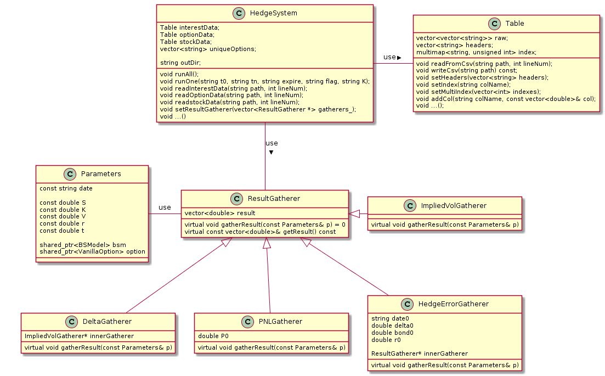
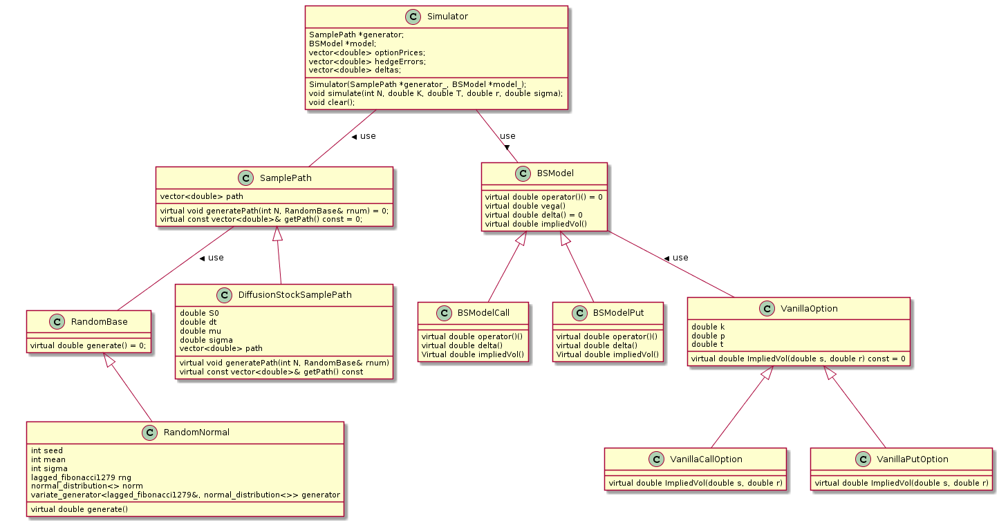
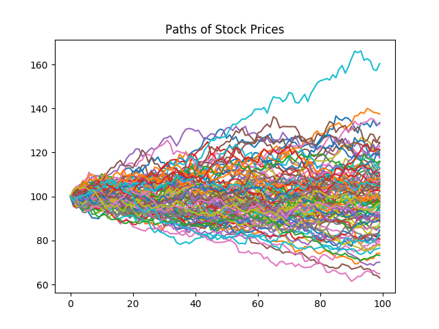
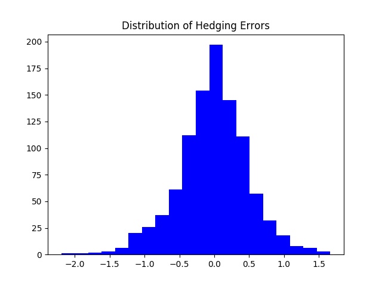

# Midterm Project Report

## Problems Addressed

The following problems are the major ones encountered and solved during implementation:
+ Generating random variables
+ Generating sample paths
+ Univariate root solving for implied volatility
+ Csv data reading and parsing
+ Business days counting
+ Plotting use cpp
+ Implementation of Black Scholes Model
+ Simulation for option pricing and delta-hedging
+ Implementation of real data delta-hedging system
+ Unit tests of the modules

>*Software entities (classes, modules, functions, etc.) should be open for extension, but closed for modification.*

Facing with above problems and based on this concept, OOP, generic programming combined with several design patterns are used to implement this project. 

Including `.h` and `.cpp` file, a total of `1538` lines of codes were written excluding emtpy lines and comments.

## Structure of Implementation

### `Random.h`
Abstract base class `RandomBase` with a abstract method `generate()` is declared. Only random normal generator with pesudo random number series `lagged_fibonacci1279` was implemented but it is easy to be extended to situations where more kinds of random variables are requried. 

### `SamplePath.h`
In sample path generating, in `SamplePath.h`, abstract base class `SamplePath` with a abstract method `generate(int N)` is declared. Only sample path under diffusion model was implemented in class `DiffusionStockSamplePath` as required but it was design to incorporate sample paths under other models like jump diffusion model, etc. Strategy pattern was applied here for it to use different random number generator.

### `RootSolver.h`
In `RootSolver.h`, struct `DerivFunctor` provides function value and its derivative. Function `NewtonRaphson` uses `DerivFunctor` to calculate univariate root based on boost library.

### `Table.h`
In `Table.h`, class `Table` can read/write csv data. Moreover, it provides method to set indexes/headers, get specific entry/entry range, and add columns.

### `DayCounter.h`
Abstract base class `Daycounter` provides two method to deal with dates. `dayCount()` to count
days between two dates. `getDates()` get a dates series for given start dates. `BusinessDayCounter` implements this interface and provides business dates counting. Moreover, in `DayCounter.cpp`, there are two different implementations of `BusinessDayCounter` which use `quantlib` and `boost` respectively.

### `Plot.h`

Provides several plotting functions which use `matplotlibcpp.h` inside.

### `BSModel.h`

In `BSModel.h`, abstract base class `BSModel` was designed to calculate option prices, greeks and implied volatility using Black-Scholes Moodel.

### `VanillaOption.h`

In `VanillaOption.h`, abstract base class `VanillaOption` was designed to calculate days to maturity and implied volatility for a specific date.

### `Simulator.h`

`Simulator` class's `simulate()` method applies `SamplePath` and `BSModel` to generate simulation about the option prices and stock prices.

### `Parameters.h`

Designed for class `ResultGatherer` as parameters taked in.

### `ResultGatherer.h`
Abstract base class `ResultGatherer` is a statistics gatherer as an implementation under strategy pattern. There are 4 kinds of gatherers in this project, which calculate delta, hedging error, implied volatility and PNL respectively. They have method `gather(const Parameters& p)` which takes in an object of class `Parameters` as argument. This is easy to be extended to any other statistics like `maxdragdown` or other greeks `gamma`, etc. Moreover, it is reusable in other situation, for example a real time system which takes a groups of arguments each time. 

### `HedgeSystem.h`
`HedgeSystem` class uses `Table` class to read in data, applies `ResultGatherer` class to generate statistics needed. Three `read*` methods are provided to read in data files. Method `runAll()` will run hedging on all the options in the data file. Method `runOne()` will run hedging on a particular option.

### `Routine.h`
This file defines two function which run under the application situation in this project. `runSimulation()` will run the required simulation and output needed pictures.
`runHedgeSystem()` will run the required hedging process and output needed results.

### `Test.h`
This file implements a simple unit test framework based on templates. The needed test
cases are written in `.cpp` files under `test` directory.

### `cpp files`

Nearly all the `.h` files have their counterparts as `.cpp` files to define their concrete implementations. 

In `main.cpp`, it does the following things.
+ run all the unit tests 
+ call function `runSimulaton()`
+ call function `runHedgeSystem()`

### Other files
+ `readme.md` specifies the compiling steps and required environments
+ `makefile` makefile for this project
+ `UML.txt` Class diagram

### Overall Class Diagram

#### Hedge System

#### Simulator

## Outcome

### Simulation

+ Sample Paths

+ Distribution of hedging errors

### Hedging

The sample results of the example option (t0=2011-07-05, tN=2011-07-29, T=2011-09-17, K = 500) is given below. 

| date       | exdate     | C | Strike| Bid | Offer | S          | rate%     | Implied Sigma | Delta    | PNL | Hedging Error | 
|------------|------------|---------|--------------|----------|------------|------------|----------|--------------------|----------|------------|---------------| 
| 2011-07-05 | 2011-09-17 | C       | 500          | 43.8     | 44.6       | 532.44 | 0.19 | 0.2572           | 0.7226 |  0.00  | 0.00      | 
| 2011-07-06 | 2011-09-17 | C       | 500          | 45.9     | 47.9       | 535.36 | 0.19 | 0.2667           | 0.7333 | 2.70   | -0.5923     | 
| 2011-07-07 | 2011-09-17 | C       | 500          | 54.9     | 55.7       | 546.60 | 0.20 | 0.2672           | 0.7876 | 11.10  | -0.7519     | 
| 2011-07-08 | 2011-09-17 | C       | 500          | 43.7     | 44.2       | 531.99 | 0.17 | 0.2658           | 0.7194 | -0.25  | -0.9121     | 
| 2011-07-11 | 2011-09-17 | C       | 500          | 40.2     | 41.8       | 527.28 | 0.17 | 0.2731           | 0.6915 | -3.20  | -1.3529     | 
| 2011-07-12 | 2011-09-17 | C       | 500          | 46       | 46.8       | 534.01 | 0.18 | 0.2838           | 0.7228 | 2.20   | -2.1010     | 
| 2011-07-13 | 2011-09-17 | C       | 500          | 49.2     | 49.4       | 538.26 | 0.16 | 0.2841           | 0.7450 | 5.10   | -1.9316     | 
| 2011-07-14 | 2011-09-17 | C       | 500          | 40.2     | 42.1       | 528.94 | 0.15 | 0.2692           | 0.7069 | -3.05  | -0.7281     | 
| 2011-07-15 | 2011-09-17 | C       | 500          | 99.3     | 100        | 597.62 | 0.15 | 0.2783           | 0.9408 | 55.45  | -10.6778    | 
| 2011-07-18 | 2011-09-17 | C       | 500          | 96.9     | 98.4       | 594.94 | 0.15 | 0.2969           | 0.9264 | 53.45  | -11.2020    | 
| 2011-07-19 | 2011-09-17 | C       | 500          | 102.1    | 105.5      | 602.55 | 0.17 | 0.2630           | 0.9603 | 59.60  | -10.3041    | 
| 2011-07-20 | 2011-09-17 | C       | 500          | 96.9     | 98.7       | 595.35 | 0.19 | 0.2960           | 0.9319 | 53.60  | -11.2220    | 
| 2011-07-21 | 2011-09-17 | C       | 500          | 107.4    | 108.9      | 606.99 | 0.20 | 0.2721           | 0.9643 | 63.95  | -10.7271    | 
| 2011-07-22 | 2011-09-17 | C       | 500          | 117.8    | 119.6      | 618.23 | 0.20 | 0.2449           | 0.9861 | 74.50  | -10.4416    | 
| 2011-07-25 | 2011-09-17 | C       | 500          | 119.2    | 120.7      | 618.98 | 0.20 | 0.2903           | 0.9716 | 75.75  | -10.9560    | 
| 2011-07-26 | 2011-09-17 | C       | 500          | 122.6    | 123.9      | 622.52 | 0.21 | 0.2829           | 0.9786 | 79.05  | -10.8201    | 
| 2011-07-27 | 2011-09-17 | C       | 500          | 107.5    | 109.8      | 607.22 | 0.21 | 0.3005           | 0.9577 | 64.45  | -11.1983    | 
| 2011-07-28 | 2011-09-17 | C       | 500          | 110.9    | 113.3      | 610.94 | 0.21 | 0.2983           | 0.9650 | 67.90  | -11.0893    | 
| 2011-07-29 | 2011-09-17 | C       | 500          | 106      | 107.6      | 603.69 | 0.20 | 0.3647           | 0.9247 | 62.60  | -12.7902    | 

The system self-finances itself each day and hedges over delta to make there is no exposure on delta, while in practical world, people will not always hedge all the exposures on delta. But still, we can see that delta hedging is efficient, when the PNL is large, the risk of naked short of this call is well-hedged. More pratically, we need to consider how much of exposure of risk we want to put on delta.

## Unit Test Cases
All the unit test cases are in `test*.cpp`

## Reflection

In this project, the key takeaways are
+ Basic C++ techniques
    + auto
    + lambda expression
    + shared_ptr
    + back_inserter_iterator
    + regex_iterator
    + containers (vector, multimap)
    + algorithms (find, transform, copy)
+ OOP design in C++
    + Use of virtual destructor
    + Use of virtual clone function
    + Use of const methods and non-const methods
+ Generic programming using C++ templates
    + Design of unit tests
+ Design patterns
    + Strategy pattern
    + Bridge pattern
+ Use of libraries 
    + Boost
        + Random
        + RootSolver
        + Datetime
    + Quantlib
        + Calendar
        + Date
    + Matplotlib-cpp
        + Plot
+ Application of Black-Scholes Model
+ Application of delta hedging

## What's More?

Where can we do better?

For the C++ codes:
+ better design? 
+ Use assertive test cases (eg, ==) to construct better unit tests? 

For the hedging processs:
+ Real time Delta Hedging for real time data flows?
+ Flexible delta hedging risk exposure setting?

