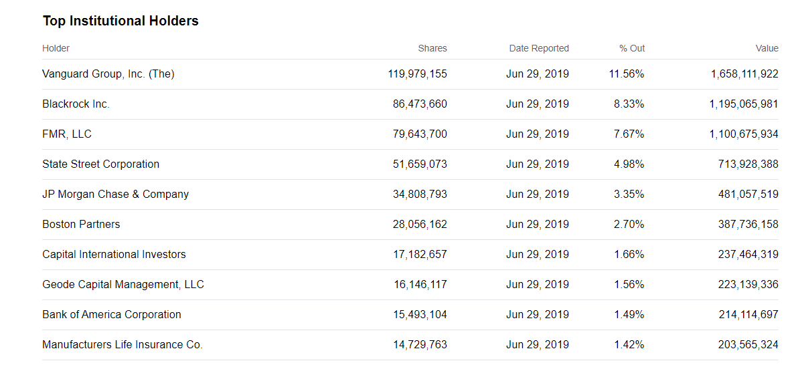
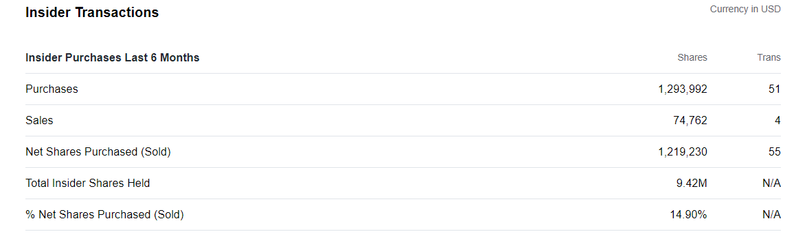
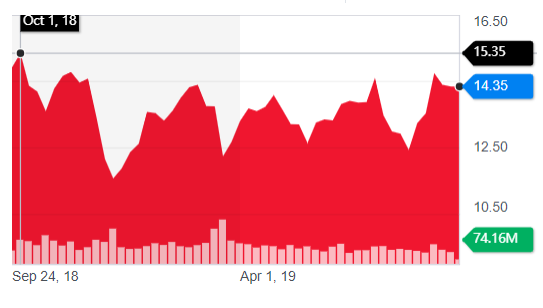
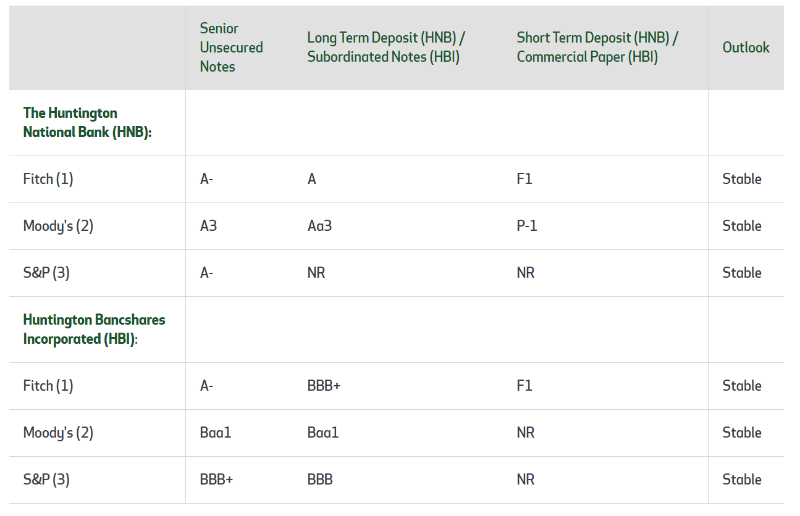
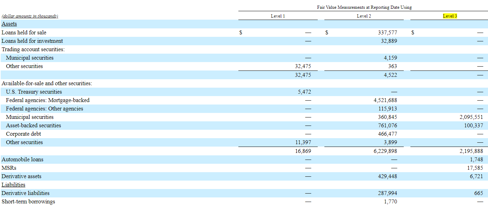

### Lei Yang
### 903532922

```{r}
library(tidyverse)
library(readr)
```


### Random Selection of Bank
Name: Lei Yang
GTID: 903532922
```{r}
set.seed(903532922)
runif(1, 1, 130) # 77.9839 Not exists
runif(1, 1, 130) # 45 not exists, 46 exists -> Huntington National Bank
```
Results of random selection: **Huntington National Bank**

## Section 1

Huntington National Bank has the following business segments.

**Retail and Business Banking** - The Retail and Business Banking segment provides a wide array of financial products and services to consumer and small business customers including but not limited to checking accounts, savings accounts, money market accounts, certificates of deposit, consumer loans, and small business loans. Other financial services available to consumer and small business customers include investments, insurance, interest rate risk protection, foreign exchange, and treasury management. Business Banking is defined as serving companies with revenues up to $20 million and consists of approximately 165,000 businesses

**Commercial Banking** - Through a relationship banking model, this segment provides a wide array of products and services to the middle market, large corporate, and government public sector customers located primarily within our geographic footprint. The segment is divided into seven business units: middle market, large corporate, specialty banking, asset finance, capital markets, treasury management, and insurance.

**Automobile Finance and Commercial Real Estate** - This segment provides lending and other banking products and services to customers outside of our traditional retail and commercial banking segments. Our products and services include providing financing for the purchase of vehicles by customers at franchised automotive dealerships, financing the acquisition of new and used vehicle inventory of franchised automotive dealerships, and financing for land, buildings, and other commercial real estate owned or constructed by real estate developers, automobile dealerships, or other customers with real estate project financing needs. Products and services are delivered through highly specializedrelationship-focused bankers and product partners.

**Regional Banking and The Huntington Private Client Group** - Regional Banking and The Huntington Private Client Group is closely aligned with our eleven regional banking markets. The Huntington Private Client Group is organized into units consisting of The Huntington Private Bank, The Huntington Trust, and The Huntington Investment Company. Our private banking, trust, and investment functions focus their efforts in our Midwest footprint and Florida.
Huntington sold Huntington Asset Advisors, Huntington Asset Services and Unified Financial Securities in the 2015 fourth quarter.

**Home Lending** - Home Lending originates and services consumer loans and mortgages for customers who are generally located in our primary banking markets. Consumer and mortgage lending products are primarily distributed through the Retail and Business Banking segment, as well as through commissioned loan originators. Home lending earns interest on loans held in the warehouse and portfolio, earns fee income from the origination and servicing of mortgage loans, and recognizes gains or losses from the sale of mortgage loans. Home Lending supports the origination and servicing of mortgage loans across all segments.

## Section 2

Major Holders

- 0.91%	% of Shares Held by All Insider
- 80.30%	% of Shares Held by Institutions
- 81.04%	% of Float Held by Institutions
- 913	Number of Institutions Holding Shares


The net purchase of shares of insiders 1,219,230 shares in 55 transactions, 14.90% of the total net purchased shares.

More detailed ownership information is shown below.

 

More detailed insider transaction information is below

 

## Section 3

Company has a beta of 1.49. The percent of Short of Shares Outstanding till Aug 14, 2019 is	2.81%, there does not exist large short interest. And company's 52 Week Range	is [11.12 15.67], which implies low volitility.

The picture below shows the one-year return of the stock, from year 2018 to year 2019, this stock experience volitility in this period.

 

The credit ratings is shown below, it has relatively high ratings.

 

Below is a recent analyst's opinions on this stock quoted on [here](https://stocknewsbrief.com/2019/09/30/drilling-down-into-analysts-opinions-on-huntington-bancshares-incorporated-nasdaqhban/)

>Some individual investors may rely heavily on Wall Street analyst opinions when conducting their own stock research. Focusing in on shares of Huntington Bancshares Incorporated (NASDAQ:HBAN), we have seen that the average broker rating is currently 2.81. This average rating follows a numerical scale where a 1 would signify a Strong Buy rating, and a 5 would indicate a Strong Sell rating. Out of the sell-side analysts polled by Zacks Research, 4 have given the stock a Strong Buy or Buy rating.
> Following shares of Huntington Bancshares Incorporated (NASDAQ:HBAN), we can see that the average consensus target price based on contributing analysts is currently $14.79. Wall Street analysts often provide price target projections on where they believe the stock will be headed in the future. Because price target projections are essentially the opinions of covering analysts, they have the ability to vary widely from one analyst to another. Navigating the equity markets can seem daunting at times. Finding ways to identify the important data can make a big difference in sustaining profits into the future. As we move closer to the end of the year, investors will be watching to see which way the momentum shifts and if stocks are still primed to go higher. Investors might choose to rely heavily on analyst research and corresponding target predictions, or they may choose to use them as a guide to supplement their own research.

## Section 4

By plotting all the ratios, we can see that the major source of bank performance is from real estate loan, it is higher than 60% percent of the banks total assets, and brings a large part of interest income , and that bank has a relatively higher return than venture capital return.
This bank ranks typically 40% - 50% percent in the markets, so it is in the middle position in its peers.

In particular, INTEREST INCOME (TE) / AVERAGE EARNING ASSETS is 4.11% in yaer 2018, and gradually increasd since 2014 at 3.53%. While NON-INTEREST INCOME / ADJUSTED OPERATING INCOME (TE) is 28.62%, decreased since 2014 at 32.89%, though non-interest income still covers large part of operating income, it has a tendency to decrease.

One should also notice PERSONNEL EXPENSE / ADJUSTED OPERATING INCOME (TE) is at 34.21%, which means, 34.21% of the income goes to employees, this is a very large part in expense, and it has deceased from 36.97% in 2014. 

Its loans can be separated into three main part, commercial and industrial loans which covers 20.78% in consolidate assets, loans to individuals which covers 15.88% in consolidated assets, real estate loans which cover 41.04% in consolidated assets. 

Its net loans covers 68.88% in its total assets and 88.22% in its total deposits. And interest rates contracts are at 24.33% in its consolidated assets and 80.88 in total derivative contracts, which means its assets are mainly formed by interest rates contracts and loans. 


```{r}
library(dplyr)
Ratios <- read_csv("~/R_Assignment_4/Ratios.csv", 
    col_types = cols(X1 = col_date(format = "%Y"))) %>%
    rename("year"=X1)

par(mfrow=c(2,4))
for (name in colnames(Ratios)[2:39])  
  {   
    plot(x=Ratios$year, y=Ratios[[name]], xlab = "year", ylab= name, type="l")
} 

```

## Section 5

Huntington subjects to:

- **Credit risk**, which is the risk of loss due to loan and lease customers or other counterparties not being able to meet their financial obligations under agreed upon terms;
- **Market risk**, which occurs when fluctuations in interest rates impact earnings and capital. Financial impacts are realized through changes in the interest rates of balance sheet assets and liabilities (net interest margin) or directly through valuation changes of capitalized MSR and/or trading assets (noninterest income);
- **Liquidity risk**, which is the risk to current or anticipated earnings or capital arising from an inability to meet obligations when they come due. Liquidity risk includes the inability to access funding sources or manage fluctuations in funding levels. Liquidity risk also results from the failure to recognize or address changes in market conditions that affect the Bank’s ability to liquidate assets quickly and with minimal loss in value;
- **Operational and legal risk**, which is the risk of loss arising from inadequate or failed internal processes or systems, human errors or misconduct, or adverse external events. Operational losses result from internal fraud; external fraud, inadequate or inappropriate employment practices and workplace safety, failure to meet professional obligations involving customers, products, and business practices, damage to physical assets, business disruption and systems failures, and failures in execution, delivery, and process management.  Legal risk includes, but is not limited to, exposure to orders, fines, penalties, or punitive damages resulting from litigation, as well as regulatory actions; and
- **Compliance risk**, which exposes us to money penalties, enforcement actions or other sanctions as a result of nonconformance with laws, rules, and regulations that apply to the financial services industry.


### Credit Risk
- The company identifies its credit risk exposures by saying that its ACL level may prove to be inappropriate or be negatively affected which is a main source of net income.
- The economic condition is crucial in its credits

### Market Risk
- Because the company's assets are mainly formed by loans and interest rates contracts, typically personal loans, commercial loans and real estate loans, it subjects to market risks because its assets, liability will be directly affected by interest rate.

### Liquidity Risk
- Its deposits has 80% goes to loans, if its condition is largely affected by the market, it will subject to large liquidity risk cause depositors will lose confidence.

### Operational and Legal Risks:
- They face security risks, including denial of service attacks, hacking, social engineering attacks targeting our colleagues and customers, malware intrusion or data corruption attempts, and identity theft that could result in the disclosure of confidential information, adversely affect our business or reputation, and create significant legal and financial exposure.
- The resolution of significant pending litigation, if unfavorable, could have a material adverse effect on our results of operations for a particular period.
- Failure to maintain effective internal controls over financial reporting in the future could impair their ability to accurately and timely report our financial results or prevent fraud, resulting in loss of investor confidence and adversely affecting our business and our stock price.
- Its business infrastructure is mainly formed by loans
- Changes in accounting policies, standards, and interpretations could materially affect how we report its financial condition and results of operations.

### Compliance Risks
- Bank regulations regarding capital and liquidity, including the annual CCAR assessment process and the Basel III capital and liquidity standards, could require higher levels of capital and liquidity. Among other things, these regulations could impact our ability to pay common stock dividends, repurchase common stock, attract cost-effective sources of deposits, or require the retention of higher amounts of low yielding securities.
- If regulators deem it appropriate, they can take regulatory actions that could result in a material adverse impact on our financial results, ability to compete for new business, or preclude mergers or acquisitions. In addition, regulatory actions could constrain our ability to fund our liquidity needs or pay dividends. Any of these actions could increase the cost of our services.
- Legislative and regulatory actions taken now or in the future that impact the financial industry may materially adversely affect us by increasing our costs, adding complexity in doing business, impeding the efficiency of our internal business processes, negatively impacting the recoverability of certain of our recorded assets, requiring us to increase our regulatory capital, limiting our ability to pursue business opportunities, and otherwise resulting in a material adverse impact on our financial condition, results of operation, liquidity, or stock price

## Section 6

### Off-Balance Sheet 

- Effective January 1, 2010, Huntington consolidated an automobile loan securitization that previously had been accounted for as an off-balance sheet transaction. As a result, Huntington elected to account for these automobile loan receivables at fair value per guidance supplied in ASC 825. The automobile loan receivables are classified as Level 3

- Like other financial instruments, derivatives contain an element of credit risk, which is the possibility that Huntington will incur a loss because the counterparty fails to meet its contractual obligations. Notional values of interest rate swaps and other off-balance sheet financial instruments significantly exceed the credit risk associated with these instruments and represent contractual balances on which calculations of amounts to be exchanged are based.

- Balance sheet hedging activity is arranged to receive hedge accounting treatment and is classified as either fair value or cash flow hedges. Fair value hedges are purchased to convert deposits and long-term debt from fixed-rate obligations to floating rate. Cash flow hedges are also used to convert floating rate loans made to customers into fixed rate loans. 

### Derivative Uasge

- Huntington uses derivatives, principally loan sale commitments, in hedging its mortgage loan interest rate lock commitments and its mortgage loans held for sale. Mortgage loan sale commitments and the related interest rate lock commitments are carried at fair value on the Consolidated Balance Sheets with changes in fair value reflected in mortgage banking income. 
- Huntington also uses certain derivative financial instruments to offset changes in value of its MSRs. These derivatives consist primarily of forward interest rate agreements and forward mortgage contracts. The derivative instruments used are not designated as qualifying hedges. Accordingly, such derivatives are recorded at fair value with changes in fair value reflected in mortgage banking income.


### Securitization Activities

The UPB of automobile loans totaling \$750 million were transferred to a trust in a securitization transaction in exchange for \$780 million of net proceeds. The securitization and resulting sale of all underlying securities qualified for sale accounting. As a result of this transaction, Huntington recognized a \$5 million gain which is reflected in gain on sale of loans on the Consolidated Statements of Income and recorded an \$11 million servicing asset which is reflected in accrued income and other assets on the Consolidated Balance Sheets.

### Level 1, 2, 3 assets

Below is a picture for overview of its level 1, 2, 3 assets.

 


